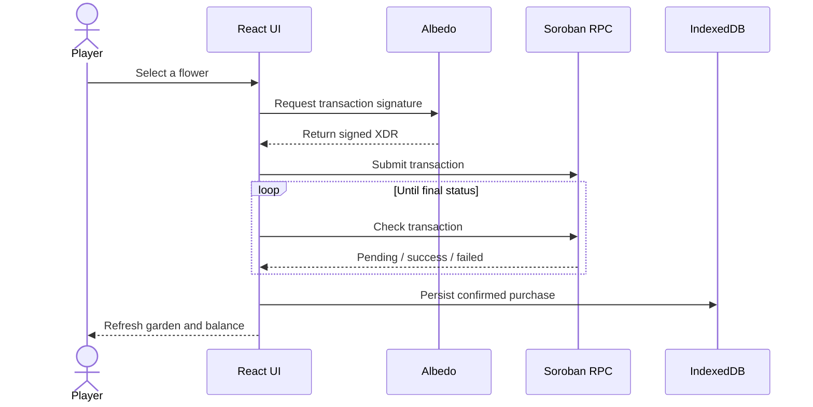

<div align="center">
  

  # Garden Game

  **A Web3 flower garden powered by React, TypeScript and Stellar Soroban**

  Grow flowers · Sign with Albedo · Settle on-chain

  <p>
    <a href="https://garden-game.vercel.app"><strong>Live demo</strong></a>
    ·
    <a href="docs/architecture.md">Architecture</a>
    ·
    <a href="docs/deployment.md">Deployment</a>
    ·
    <a href="CONTRIBUTING.md">Contributing</a>
  </p>

  <p>
    <a href="https://garden-game.vercel.app">
      
    </a>
    <a href="https://github.com/antipozitife/gardengame/actions/workflows/ci.yml">
      
    </a>
    
    
    
    
    
  </p>
</div>

<a href="https://garden-game.vercel.app">
  
</a>

> [!NOTE]
> Garden Game works on **Stellar testnet**. No real funds are required for the demo.

## Preview

<div align="center">
  <a href="https://garden-game.vercel.app">
    
  </a>
  <br />
  <sub>From seed to an on-chain garden — explore, buy, water and grow.</sub>
</div>

## Why this project

Garden Game is more than a landing page. It demonstrates a complete frontend workflow around
asynchronous blockchain operations: wallet authorization, transaction signing, network
confirmation, local persistence and resilient UI states.

| Product experience | Engineering |
| --- | --- |
| Flower shop and personal garden | React 18 + strict TypeScript |
| Albedo wallet connection | Stellar SDK + Soroban RPC |
| Purchase and watering flows | IndexedDB persistence with `idb` |
| Balance, cooldown and moisture states | Context + reusable domain hooks |
| Light/dark themes and motion | Route-level code splitting |
| Responsive and keyboard-friendly UI | Jest, RTL, ESLint, Prettier and CI |

## Highlights

- **Confirmed transactions** — purchases are persisted only after Stellar reports success.
- **Clear async UX** — signing, confirmation, network wait, success and error states are visible.
- **Resilient data layer** — the garden is indexed by wallet and remains available in IndexedDB.
- **Accessible interactions** — skip links, focus trap, focus restoration, ARIA progress values,
  carousel controls and reduced-motion support.
- **Fast navigation** — pages are split with `React.lazy` and loaded through `Suspense`.
- **Production workflow** — lint, strict typecheck, 34 tests and Webpack build run in CI.

## How it works



## Architecture

```text
src/
├── components/        feature components and reusable UI
├── context/           wallet and theme providers
├── hooks/             purchase, garden, wallet and toast logic
├── services/          Stellar/Soroban and IndexedDB adapters
├── pages/             lazy-loaded route screens
├── data/              flower catalog
├── constants/         domain and environment configuration
├── types/             shared TypeScript contracts
└── utils/             pure, tested garden/error logic
```

The UI does not call browser storage or RPC endpoints directly. Components consume focused hooks;
hooks coordinate domain state; services isolate infrastructure. More detail is available in
[the architecture document](docs/architecture.md) and
[the decision log](docs/decisions.md).

## Tech stack

| Area | Tools |
| --- | --- |
| Interface | React 18, React Router, Framer Motion, CSS |
| Language | TypeScript in strict mode |
| Bundler | Webpack 5 through Create React App |
| Web3 | Stellar SDK, Soroban RPC, Albedo |
| Persistence | IndexedDB with `idb` |
| Feedback | React Hot Toast, skeletons, spinners and error states |
| Quality | Jest, React Testing Library, ESLint, Prettier, Husky |
| Delivery | GitHub Actions, Vercel, Docker and nginx |

## Quick start

Requirements: Node.js 20+ and npm.

```bash
git clone https://github.com/antipozitife/gardengame.git
cd gardengame
cp .env.example .env
npm ci
npm start
```

Open [http://localhost:3000](http://localhost:3000).

The checked-in environment defaults point to Stellar testnet. Public endpoints and contract
addresses can be overridden through `.env`; never place secrets in `REACT_APP_*` variables because
Webpack embeds them in the browser bundle.

## Quality gates

```bash
npm run lint
npm run typecheck
npm run test:ci
npm run build
```

Current test suite: **11 suites · 34 tests**.

Every pull request runs the same checks in
[GitHub Actions](.github/workflows/ci.yml). A pre-push hook catches failures locally.

## Docker

```bash
docker compose up --build
```

The app is available at [http://localhost:8080](http://localhost:8080). The production image uses a
multi-stage Node build and serves the static Webpack bundle through nginx with SPA fallback.

## Documentation

- [Architecture](docs/architecture.md)
- [Frontend notes](docs/frontend.md)
- [Smart contract](docs/smart-contract.md)
- [Deployment](docs/deployment.md)
- [Architecture decisions](docs/decisions.md)
- [Contributing guide](CONTRIBUTING.md)
- [Changelog](CHANGELOG.md)

## Roadmap

- [ ] Playwright end-to-end coverage
- [ ] Achievements and daily rewards
- [ ] On-chain balance as the primary garden source
- [ ] Transaction history with Stellar Explorer links

## License

Released under the [MIT License](LICENSE).

<div align="center">
  <strong>Built with React, TypeScript, Webpack and Stellar.</strong>
</div>
