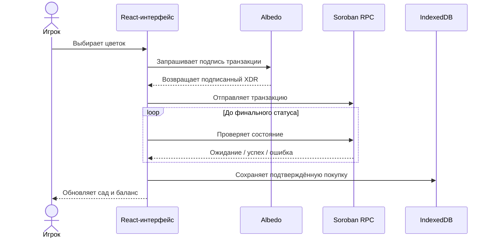

<div align="center">
  

  # Garden Game

  **Web3-сад на React, TypeScript и Stellar Soroban**

  Выращивайте цветы · Подписывайте операции через Albedo · Сохраняйте результат в блокчейне

  <p>
    <a href="https://gardengame-mpkqykriv-antipozitifes-projects.vercel.app"><strong>Открыть приложение</strong></a>
    ·
    <a href="docs/architecture.md">Архитектура</a>
    ·
    <a href="docs/deployment.md">Развёртывание</a>
    ·
    <a href="CONTRIBUTING.md">Участие в разработке</a>
  </p>

  <p>
    <a href="https://gardengame-mpkqykriv-antipozitifes-projects.vercel.app/">
      
    </a>
    <a href="https://github.com/antipozitife/gardengame/actions/workflows/ci.yml">
      
    </a>
    
    
    
    
    
  </p>
</div>

<a href="https://gardengame-mpkqykriv-antipozitifes-projects.vercel.app/">
  
</a>

<div align="center">
  <sub>Предпросмотр автоматически создаётся из актуальной версии, опубликованной на Vercel.</sub>
</div>

> [!NOTE]
> Приложение работает в сети **Stellar testnet**. Для демонстрации не нужны реальные средства.

## О проекте

Garden Game — это не только лендинг, а полноценный frontend-проект с асинхронным Web3-сценарием:
подключением кошелька, подписью транзакций, ожиданием подтверждения сети, локальным хранением
покупок и устойчивыми состояниями интерфейса.

| Пользовательские возможности | Техническая реализация |
| --- | --- |
| Магазин цветов и личный сад | React 18 и TypeScript в strict-режиме |
| Подключение кошелька Albedo | Stellar SDK и Soroban RPC |
| Покупка и полив растений | IndexedDB через библиотеку `idb` |
| Баланс, влажность и cooldown | Context API и предметные хуки |
| Светлая и тёмная темы | CSS-переменные и Framer Motion |
| Адаптивный интерфейс | Lazy loading и разделение кода по маршрутам |

## Ключевые особенности

- **Подтверждённые транзакции** — покупка сохраняется только после успешного ответа Stellar.
- **Понятный асинхронный UX** — интерфейс показывает подпись, ожидание сети, успех и ошибки.
- **Надёжное хранение** — растения сохраняются в IndexedDB и индексируются по адресу кошелька.
- **Доступность** — skip-ссылки, focus trap, возврат фокуса, ARIA-индикаторы и reduced motion.
- **Быстрая навигация** — страницы загружаются через `React.lazy` и `Suspense`.
- **Автоматическая проверка** — ESLint, TypeScript, 34 теста и Webpack-сборка запускаются в CI.

## Как проходит покупка



## Архитектура

```text
src/
├── components/        функциональные компоненты и UI-примитивы
├── context/           провайдеры кошелька и темы
├── hooks/             логика магазина, сада, кошелька и уведомлений
├── services/          адаптеры Stellar/Soroban и IndexedDB
├── pages/             страницы с ленивой загрузкой
├── data/              каталог цветов
├── constants/         настройки окружения и предметные константы
├── types/             общие TypeScript-типы
└── utils/             чистая и покрытая тестами логика
```

Компоненты не обращаются к RPC или браузерному хранилищу напрямую. UI использует предметные хуки,
хуки управляют состоянием, а сервисы изолируют работу с внешней инфраструктурой. Подробнее:
[архитектура](docs/architecture.md) и
[журнал технических решений](docs/decisions.md).

## Технологии

| Область | Инструменты |
| --- | --- |
| Интерфейс | React 18, React Router, Framer Motion, CSS |
| Язык | TypeScript в strict-режиме |
| Сборка | Webpack 5 через Create React App |
| Web3 | Stellar SDK, Soroban RPC, Albedo |
| Хранение | IndexedDB и `idb` |
| Обратная связь | React Hot Toast, skeleton, spinner и error states |
| Качество | Jest, React Testing Library, ESLint, Prettier, Husky |
| Доставка | GitHub Actions, Vercel, Docker и nginx |

## Локальный запуск

Требования: Node.js 20+ и npm.

```bash
git clone https://github.com/antipozitife/gardengame.git
cd gardengame
cp .env.example .env
npm ci
npm start
```

Приложение будет доступно по адресу [http://localhost:3000](http://localhost:3000).

Значения по умолчанию настроены на Stellar testnet. Публичные RPC-адреса и адреса контрактов можно
переопределить через `.env`. Секреты нельзя хранить в переменных `REACT_APP_*`, потому что Webpack
встраивает их в клиентский bundle.

## Проверка качества

```bash
npm run lint
npm run typecheck
npm run test:ci
npm run build
```

Текущее покрытие сценариев: **11 test suites · 34 теста**.

На каждый pull request эти же проверки запускаются через
[GitHub Actions](.github/workflows/ci.yml). Pre-push hook помогает обнаружить ошибки локально.

## Запуск в Docker

```bash
docker compose up --build
```

Приложение будет доступно по адресу [http://localhost:8080](http://localhost:8080). Production-образ
собирается в несколько стадий и раздаёт статический Webpack-bundle через nginx с поддержкой
SPA-маршрутов.

## Документация

- [Архитектура](docs/architecture.md)
- [Frontend](docs/frontend.md)
- [Смарт-контракт](docs/smart-contract.md)
- [Развёртывание](docs/deployment.md)
- [Технические решения](docs/decisions.md)
- [Участие в разработке](CONTRIBUTING.md)
- [История изменений](CHANGELOG.md)

## Планы развития

- [ ] End-to-end тесты на Playwright
- [ ] Достижения и ежедневные награды
- [ ] On-chain состояние сада как основной источник данных
- [ ] История транзакций со ссылками на Stellar Explorer

## Лицензия

Проект распространяется по лицензии [MIT](LICENSE).

<div align="center">
  <strong>Создано с React, TypeScript, Webpack и Stellar.</strong>
</div>
